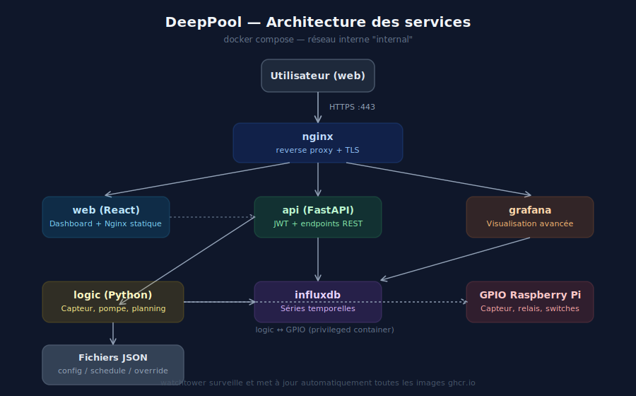
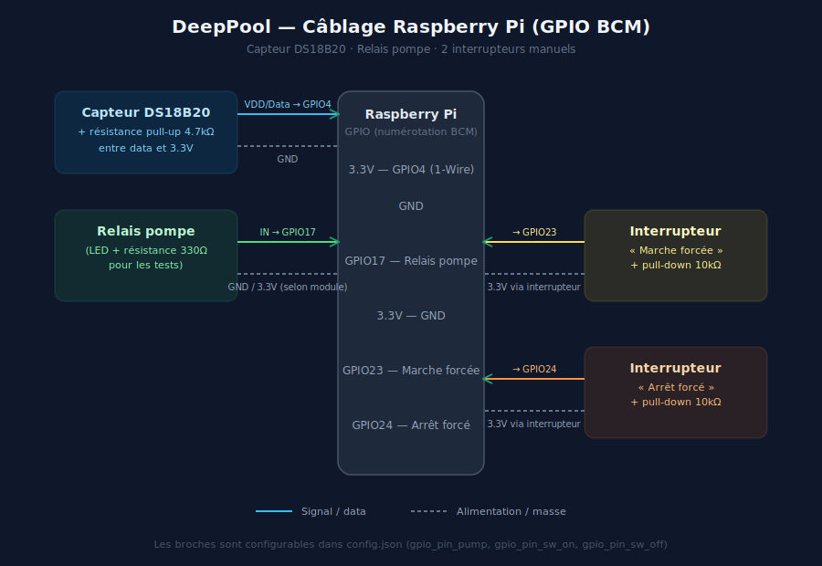

# 🏊 DeepPool

DeepPool est un système open source de pilotage automatique de la pompe de filtration d'une piscine, basé sur un **Raspberry Pi**. Il mesure la température de l'eau, décide quand faire tourner la pompe (selon la température, un planning horaire, ou une commande manuelle), enregistre l'historique dans **InfluxDB**, et expose un **dashboard web** ainsi qu'un tableau de bord **Grafana**.

---

## ✨ Fonctionnalités

- 🌡️ Mesure en continu de la température de l'eau (capteur DS18B20)
- 💧 Pilotage d'un relais de pompe via GPIO
- ⚙️ Logique de décision à 4 niveaux de priorité :
  1. **Interrupteur physique** (marche / arrêt forcés)
  2. **Override web** (depuis le dashboard)
  3. **Planning horaire** (avec extensions selon la température)
  4. **Hystérésis température** (`temp_on` / `temp_off`)
- 📅 Planning configurable, y compris les plages à cheval sur minuit (ex : 22h00 → 03h30)
- 📊 Historique température + état de la pompe dans InfluxDB, visualisable sur le dashboard et dans Grafana
- 🌐 Dashboard React (clair/sombre) accessible depuis l'extérieur, sécurisé par JWT
- 🔄 Mises à jour automatiques des conteneurs via Watchtower
- 🚀 Images Docker construites et publiées automatiquement par GitHub Actions (ARM/v7)

---

## 🏗️ Architecture

Le projet est entièrement conteneurisé. Chaque service a un rôle précis et communique avec les autres via un réseau Docker interne.



| Service | Rôle |
|---|---|
| `logic` | Lit le capteur, pilote le relais, applique la logique de décision (Python) |
| `influxdb` | Stocke l'historique température / état pompe (InfluxDB v2) |
| `grafana` | Tableaux de bord avancés |
| `api` | API REST (FastAPI) sécurisée par JWT, lue/écrite par le dashboard |
| `web` | Dashboard React (servi par Nginx) |
| `nginx` | Reverse proxy HTTPS, route `/`, `/api/` et `/grafana/` |
| `watchtower` | Met à jour automatiquement les images Docker |

Les modules `logic` et `api` communiquent entre eux **uniquement via des fichiers JSON partagés** (`config.json`, `schedule.json`, `override.json`), montés en volume dans les deux conteneurs. Cela permet de modifier la configuration à chaud, sans redémarrage.

---

## 🔌 Câblage électronique

Le Raspberry Pi pilote trois éléments en GPIO : le capteur de température, le relais de la pompe, et deux interrupteurs de commande manuelle.



| Élément | GPIO (BCM) | Détails |
|---|---|---|
| Capteur DS18B20 | GPIO4 (bus 1-Wire) | Résistance pull-up 4.7 kΩ entre data et 3.3V |
| Relais pompe | GPIO17 (configurable) | Piloté en sortie, HIGH = pompe activée |
| Interrupteur « Marche forcée » | GPIO23 (configurable) | Entrée + résistance pull-down 10 kΩ |
| Interrupteur « Arrêt forcé » | GPIO24 (configurable) | Entrée + résistance pull-down 10 kΩ |

> ⚠️ Le 1-Wire doit être activé sur le Raspberry Pi (`sudo raspi-config` → Interface Options → 1-Wire), et le module `w1-gpio` doit être chargé au démarrage.

Les numéros de GPIO sont modifiables dans `config.json` (`gpio_pin_pump`, `gpio_pin_sw_on`, `gpio_pin_sw_off`) sans avoir à reconstruire les images.

---

## 📦 Prérequis

- Un **Raspberry Pi** (testé sur Pi 3B+) avec Raspberry Pi OS, Docker et Docker Compose installés
- Un capteur **DS18B20** et un relais (ou une LED de test) câblés selon le schéma ci-dessus
- Un nom de domaine pointant vers l'IP publique du Pi, si tu veux un accès HTTPS depuis l'extérieur
- (Optionnel) Un certificat TLS pour Nginx (Let's Encrypt par exemple)

---

## 🚀 Installation

### 1. Cloner le projet

```bash
git clone https://github.com/<ton-compte>/DeepPool.git
cd DeepPool
```

### 2. Configurer les variables d'environnement

```bash
cp .env.template .env
nano .env
```

| Variable | Description |
|---|---|
| `GRAFANA_ADMIN_USER` / `GRAFANA_ADMIN_PASSWORD` | Identifiants de l'admin Grafana |
| `INFLUXDB_ADMIN_USER` / `INFLUXDB_ADMIN_PASSWORD` | Identifiants de l'admin InfluxDB |
| `INFLUXDB_ORG` / `INFLUXDB_BUCKET` | Organisation / bucket InfluxDB (ex : `deeppool`) |
| `INFLUXDB_ADMIN_TOKEN` | Token d'API InfluxDB — génère-le avec `openssl rand -hex 32` |
| `API_USERNAME` / `API_PASSWORD` | Identifiants de connexion au dashboard |
| `API_SECRET_KEY` | Clé de signature des JWT — génère-la avec `openssl rand -hex 32` |
| `DOMAIN` | Nom de domaine utilisé pour les URLs Grafana et Nginx |

### 3. Créer les fichiers de configuration

Ces fichiers pilotent le comportement de `logic` et sont modifiables à chaud (rechargés à chaque cycle, et via le dashboard) :

**`config.json`** — seuils de température et broches GPIO :
```json
{
    "temp_on": 28.0,
    "temp_off": 25.0,
    "gpio_pin_pump": 17,
    "gpio_pin_sw_on": 23,
    "gpio_pin_sw_off": 24,
    "fast_interval_seconds": 5,
    "loop_interval_seconds": 60
}
```

**`schedule.json`** — planning horaire (vide par défaut = température seule) :
```json
{
    "schedule": []
}
```

**`override.json`** — état de l'override manuel :
```json
{
    "web": null,
    "physical": null
}
```

### 4. Configurer Nginx

Édite `nginx/nginx.conf` et remplace `deeppool.galpin.fr` par ton propre nom de domaine. Ajoute également la configuration TLS (certificats Let's Encrypt) si tu veux du HTTPS.

### 5. Démarrer le projet

```bash
docker compose up -d
```

Les images `logic`, `api` et `web` sont récupérées automatiquement depuis GitHub Container Registry (GHCR) — aucun build local nécessaire. `watchtower` les maintiendra à jour automatiquement.

### 6. Vérifier que tout fonctionne

```bash
docker compose ps
docker logs deeppool-logic
```

Tu dois voir apparaître des lignes du type :
```
🚀 DeepPool starting...
[14:32:10] 24.3°C — pompe OFF (auto temp)
```

---

## 🖥️ Utilisation

### Dashboard web

Rends-toi sur `https://<ton-domaine>/` et connecte-toi avec `API_USERNAME` / `API_PASSWORD`.

Le dashboard permet de :
- Visualiser la température actuelle, l'état de la pompe et le mode actif (auto / planning / override web / interrupteur physique)
- Voir la courbe de température et l'historique d'activation de la pompe (6h à 7 jours)
- Forcer la pompe en marche / arrêt / automatique
- Modifier les seuils `temp_on` / `temp_off`
- Créer et modifier le planning horaire, avec extensions selon la température moyenne de la veille
- Voir le planning prévu pour la journée en cours

### Grafana

Accessible sur `https://<ton-domaine>/grafana/` avec `GRAFANA_ADMIN_USER` / `GRAFANA_ADMIN_PASSWORD`. La source de données InfluxDB doit être configurée manuellement (langage **Flux**, organisation et bucket définis dans `.env`, token = `INFLUXDB_ADMIN_TOKEN`).

---

## ⚙️ Logique de décision

À chaque cycle, `logic` détermine l'état de la pompe en suivant cet ordre de priorité :

```
1. Interrupteur physique (GPIO23 / GPIO24)
       │ si activé → priorité absolue
       ▼
2. Override web (override.json → "web")
       │ si défini (true/false) → priorité
       ▼
3. Planning horaire (schedule.json)
       │ si dans une plage active → pompe ON
       ▼
4. Température (hystérésis temp_on / temp_off)
```

Le planning peut être conditionné à une température moyenne minimale (`min_temp`, calculée sur la journée précédente) et étendu après l'heure de fin si la température dépasse certains seuils (`extensions`).

---

## 🛠️ Développement

Chaque service possède son propre `Dockerfile` et peut être buildé localement :

```bash
docker compose build logic
docker compose build api
docker compose build web
```

Le pipeline CI (`.github/workflows/docker-publish.yml`) construit et publie automatiquement les trois images sur GHCR à chaque push sur `main`, pour la plateforme `linux/arm/v7`.

---

## 📁 Structure du projet

```
DeepPool/
├── config.json / schedule.json / override.json   # Configuration (non versionnés)
├── docker-compose.yml
├── logic/        # Service Python : capteur, pompe, planning
├── api/          # API FastAPI
├── web/          # Dashboard React
├── nginx/        # Reverse proxy
└── docs/         # Schémas (ce README)
```

---

## 📜 Licence

Projet personnel — libre d'utilisation et d'adaptation pour vos propres installations.